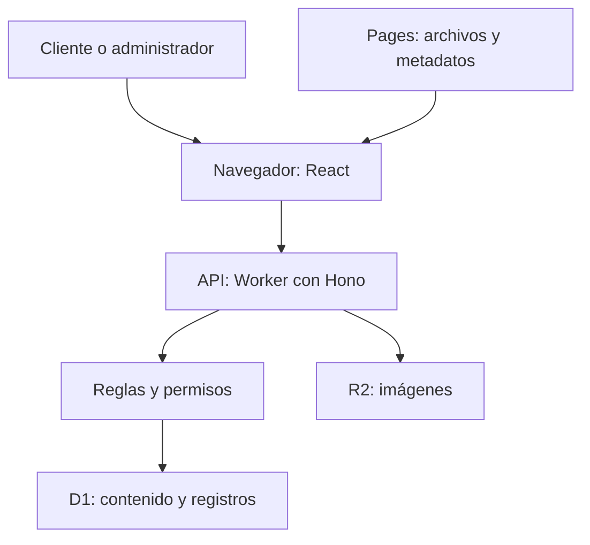

# Cómo funciona por dentro

[Volver al índice](README.md)

Piensa en un restaurante: la pantalla es el salón, la API recibe las solicitudes, las reglas verifican lo que se puede hacer, D1 lleva los registros y R2 guarda las imágenes. Cloudflare ejecutará estas piezas al publicarlas. En desarrollo se imitan localmente.

El dibujo es conceptual. Localmente Vite recibe `/api` y lo reenvía al Worker. En producción Pages Functions hace ese puente mediante un binding: una conexión privada entre servicios de la misma cuenta. No es necesario que el cliente conozca la dirección interna del Worker.

## Una visita a la carta

1. `frontend/index.html` proporciona el espacio inicial de la página.
2. `main.tsx`, función `App`, identifica la ruta. Para `/m/1` extrae el identificador de mesa.
3. `api()` pide `/api/content`. En `worker/public.ts` se carga el negocio mediante `getContent()`.
4. `publicContent()` elimina contenido inactivo, aplica agotados y fechas del anuncio. La API entrega una copia para el visitante.
5. `applyTheme()` aplica letras y colores. `PublicApp()` dibuja los bloques; `Menu()` filtra categorías y búsqueda en el navegador.
6. `track()` intenta registrar eventos. Un fallo de estadísticas no impide leer la carta.

## Una edición de contenido

El panel carga contenido privado completo más un número de versión. `Editor()` cambia una copia en memoria. `draftChanges()` la compara con la copia guardada. `DraftPreview()` envía esa copia a una pequeña página interna mediante mensajes del navegador. `PreviewApp()` verifica quién mandó el mensaje y utiliza los mismos componentes públicos para dibujarlo.

Guardar ejecuta primero validación local y después una solicitud PUT al servidor. El servidor vuelve a comprobar sesión, rol y contenido: no confía en que el navegador ya lo haya comprobado. La base modifica el registro solo si sigue teniendo la versión que el editor cargó. Si funcionó, aumenta la versión y agrega auditoría. Si alguien se adelantó, devuelve un conflicto. Esta protección evita que el último en guardar borre silenciosamente el trabajo de otra persona.

La imagen se sube por un camino independiente. Por eso no se debe interpretar Descartar como eliminar archivos ya subidos.

## Una reserva

`Reservations()` comprueba primero la sesión. Sin ella muestra un enlace a iniciar sesión con retorno a reservas. Luego recoge datos. El servidor aplica límite de solicitudes y comprobación anti-bots, valida campos y convierte fecha/hora de Chile a un instante comparable. Calcula 90 minutos de duración, toma account_id de la sesión (nunca del visitante), carga mesas y reservas y llama a `availableTables()`.

Se intenta guardar en una mesa candidata. Aunque dos personas soliciten simultáneamente el mismo horario, las reglas internas de D1 vuelven a comprobar capacidad y superposición. Un conflicto puede hacer que se intente otra mesa. Al tener éxito responde solicitud pendiente, nunca confirmación automática.

Ejemplo: una reserva de 14:00 a 15:30 impide otra a las 15:00 en esa mesa; una a las 15:30 puede ser contigua. El personal sigue siendo responsable de confirmar horario de atención y disponibilidad real.

## Una imagen

`ImageField()` lee una foto, reduce su lado mayor a un máximo de 1600 píxeles sin ampliarla, la convierte a WebP y la envía. `validateImage()` comprueba tamaño, extensión, MIME (tipo declarado) y firma (bytes característicos). `R2StorageProvider.put()` guarda con un nombre aleatorio. La respuesta contiene una URL, que pasa al borrador. La base guarda esa dirección, no los bytes de la imagen.

## Un reporte

El navegador genera un identificador de sesión temporal. El servidor valida que el evento corresponda a un destino real y guarda un resumen hash de sesión, tipo, destino y ventana temporal. Una restricción de unicidad elimina repetidos equivalentes.

El panel pide un período y opcionalmente un negocio. La API agrupa registros. `reportMessage()` suma canales equivalentes; `PreviewReportDeliveryProvider.deliver()` prepara el texto y devuelve `sent:false`. El nombre deliver significa entregar, pero esta implementación de prueba no realiza ningún envío.

## Mapa de carpetas

- `frontend/src/public`: portada, carta, recomendados y formularios.
- `frontend/src/account`: acceso común, registro y reservas de la cuenta.
- `frontend/src/admin`: login, edición, borrador, diseño y operaciones.
- `frontend/src/components.tsx`: piezas visuales reutilizadas.
- `frontend/src/styles.css`: distribución, tamaños, pantallas pequeñas y variables de tema.
- `shared`: reglas y tipos utilizados por navegador y servidor, para no mantener dos versiones diferentes.
- `worker`: puertas de entrada, permisos, guardado, reportes y archivos.
- `functions/[[path]].ts`: servicio de Pages que responde a rutas, genera metadatos para compartir y reenvía `/api`.
- `migrations`: instrucciones para crear tablas y protecciones de D1.
- `scripts`: tareas manuales de preparación; no corren por visitar la web.
- `tests`: pruebas que detectan regresiones; no son funciones del restaurante.
- `frontend/public`: imágenes originales y cabeceras estáticas.
- `docs`: esta guía.
- `work`, `.wrangler`, `dist`, `node_modules`: temporales, datos locales, compilación y bibliotecas; no se suben a GitHub.

## Qué significa cada archivo de configuración

`package.json` enumera bibliotecas y comandos; `package-lock.json` fija las versiones instaladas. `tsconfig.json` controla las comprobaciones de TypeScript. `vite.config.ts` prepara frontend y proxy local. `wrangler.worker.jsonc` describe API/D1/R2 y entornos; `wrangler.jsonc` describe Pages y su conexión al Worker. `worker/env.ts` declara qué recursos y variables espera el código.

`eslint.config.js` define revisión de código; `.prettierignore` excluye archivos del formateo. `vitest.config.ts` configura pruebas de reglas y API. `playwright.config.ts` configura navegador, dirección local, tamaño móvil y pruebas secuenciales. `.gitignore` excluye secretos, datos locales y generados. `.env.example` tiene ejemplos de variables, nunca credenciales reales. `LICENSE` contiene la licencia MIT actual. `app.py` es un archivo inicial conservado y no participa en esta web.

## Acceso compartido y separación de clientes

worker/auth.ts busca credenciales en users (equipo) y customers (clientes). Cada grupo conserva su tabla de sesiones; ambos usan la misma cookie protegida. authenticate identifica el grupo desde la base y permit sigue rechazando clientes en cada ruta administrativa. El registro público siempre crea cliente; los roles de equipo solo se crean mediante la ruta administrativa protegida. La consulta de Mis reservas filtra simultáneamente business_id y account_id de la sesión.
